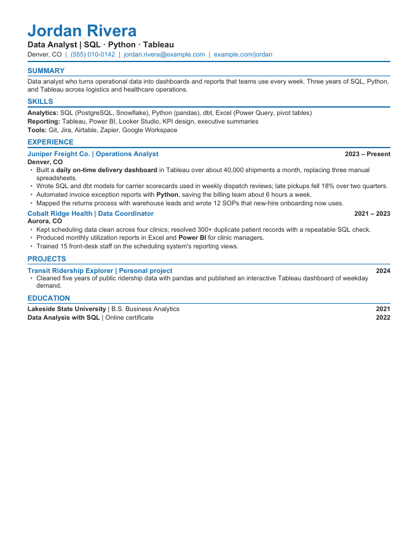
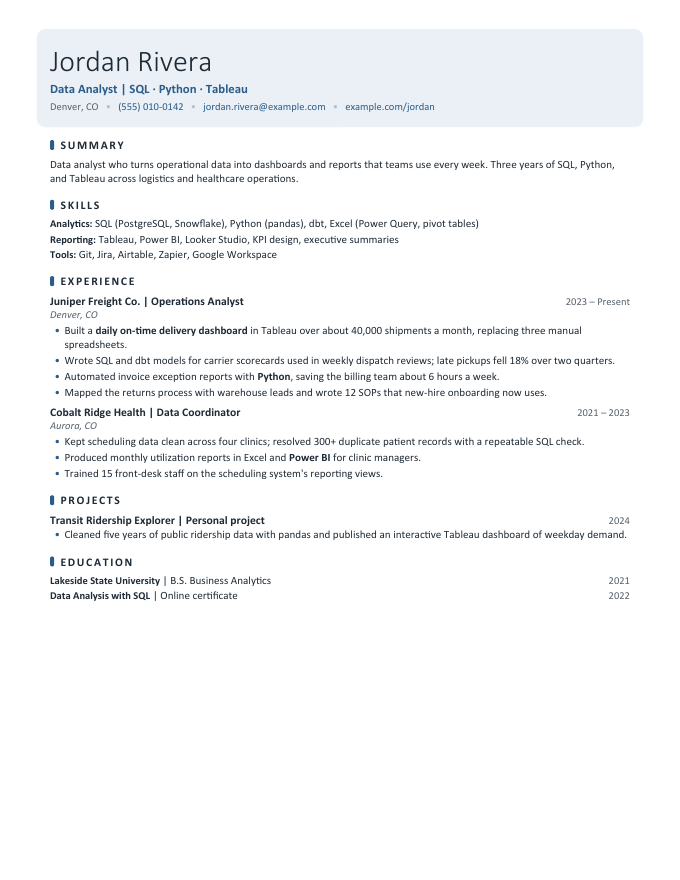
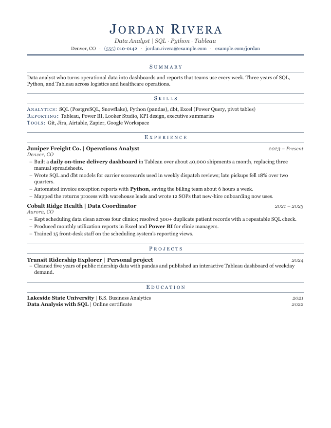
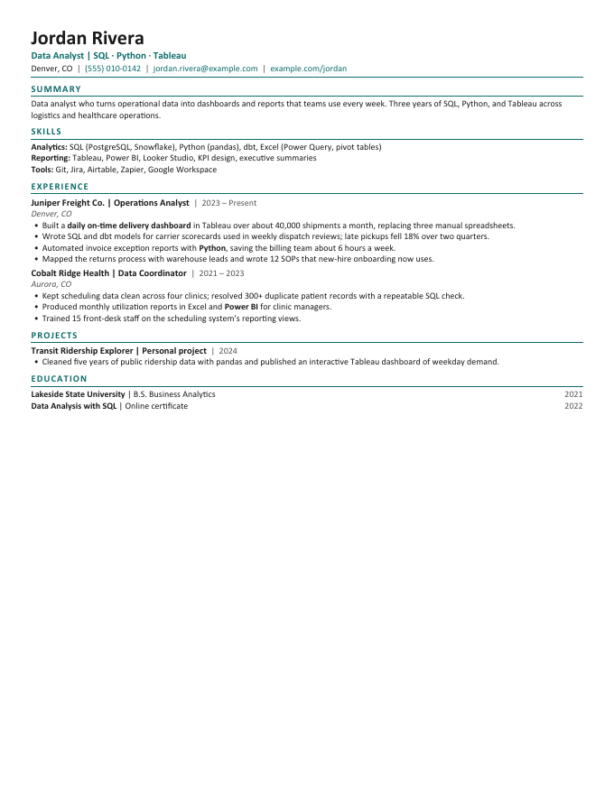
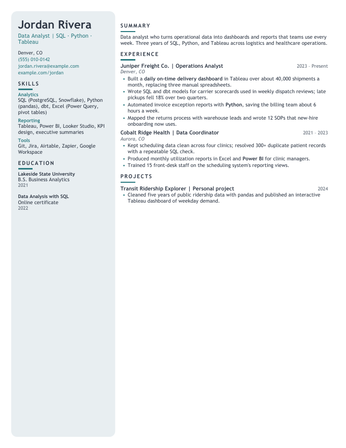
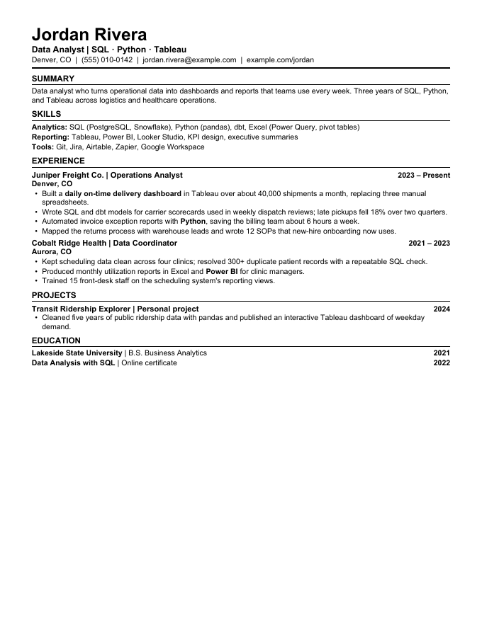

# factloom

Truthful, agent-driven job applications. You write every fact about your work once; factloom weaves those facts into tailored resumes, cover letters, and form answers, and an AI agent (Claude Code, Codex, or any agent that reads `AGENTS.md`) applies to jobs from your browser while recording everything it sends.

| classic-blue | modern | executive |
|:---:|:---:|:---:|
|  |  |  |
| **compact** | **sidebar** | **plain** |
|  |  |  |

*Every resume above is built from the same facts file of a fictional person ([examples/demo](examples/demo)); only the theme differs. Themes are short YAML files you can copy and change: colors, fonts, type, corners, heading styles, and layout.*

## What it does

- **One source of truth.** Each claim lives once in `facts.yaml`. Resume versions (variants) pick and order facts for a kind of role; themes decide the look. Fix a typo once and every resume picks it up.
- **Truth-locked.** A claim you have not confirmed carries a `confirm` flag: the resume is marked for review, tailoring refuses it, and cover letters may not repeat it until you confirm.
- **Applies for you.** Open job postings or job sites in the browser your agent controls and say "apply to the jobs open in my browser." The agent captures each posting, picks and tailors a resume, writes a cover letter when wanted, fills the form from your answers, submits or holds it, and records what it sent.
- **Asks before it guesses.** Each session starts with onboarding (work authorization, travel, salary approach, and so on). New questions from forms land in your inbox for review, so the next session already knows them.
- **Keeps your data private.** Your people and settings live in your own private repository; a pre-push guard refuses to send them anywhere else.

## Quick start

You need [git](https://git-scm.com), [Node.js](https://nodejs.org) 22.18 or later, and for PDFs [LibreOffice](https://www.libreoffice.org). The [GitHub CLI](https://cli.github.com) makes the private copy in step 3 one command.

1. Clone this repository (do not fork it: a fork of a public repository is public, and so would your resume be).

   ```bash
   git clone https://github.com/DevGuyRash/factloom.git my-job-search
   ```

2. Set it up. The first run installs the tools' dependencies.

   ```bash
   cd my-job-search && ./resumes setup
   ```

3. Make your private copy on GitHub. This turns the engine into a read-only `upstream` you update from, and creates a private repository as `origin` for your data.

   ```bash
   ./resumes setup --private-repo my-job-search
   ```

4. Open Claude Code or Codex in the folder and say **"set me up"**. The agent creates your profile, imports your current resume, turns it into your facts file, shows it to you in a few themes, and runs onboarding.
5. Open job postings in your agent's browser and say **"apply to the jobs open in my browser."**

On Windows, use `resumes.cmd` in place of `./resumes`, and enable Developer Mode before cloning so git can create the skill links (`git config --global core.symlinks true`), or use WSL.

## Make it yours

- **Themes.** `./resumes themes list` shows them, `./resumes themes preview --png` renders your resume in each with page counts, and `./resumes themes new mine --from modern` starts your own. A theme can extend another and change only what differs:

  ```yaml
  # custom/templates/themes/modern-teal.yaml
  extends: modern
  colors: { accent: "0F766E", tint: "E6F4F1" }
  corners: square
  headings: { style: band }
  ```

  Every setting is listed in [docs/themes.md](docs/themes.md). `./resumes themes check` warns about hard-to-read colors and fonts your machine lacks.
- **Page targets.** Set `pages: 2` in a variant and the build tightens spacing, then type (never below 9 pt), then margins until it fits.
- **Applicant tracking systems.** Themes marked `ats: safe` read cleanly in job portals; the sidebar layout is marked `ats: caution`, for resumes a person reads first.
- **Your own layer.** Put changes in `custom/` (themes, document templates, extra onboarding questions, scoring numbers, skill terms, site notes) or in `people/<you>/templates/`. They override the engine's defaults and survive every update.

## Privacy

- `people/` and `custom/` hold your data. They belong only in your private repository: the pre-push guard refuses to push them anywhere else, and refuses personal details in changes bound for the public engine. `./resumes doctor` warns if your repository is public.
- Street addresses and anything else you keep out of git go in `*.local.*` files, which git ignores. Session answers are kept in one of those too.
- Government ID numbers, dates of birth, passwords, and bank details are never stored: you type them into the form yourself, and the agent holds the application for you.
- The pre-commit hook scans staged files for personal data such as street addresses, card numbers, and keys.

## Updating

```bash
./resumes update
```

It merges the newest engine, reinstalls dependencies when they changed, runs the checks, and lists any of your resumes the new engine renders differently so you can rebuild and review them. It refuses to start if engine files were edited in your copy, and says how to move those changes into `custom/`.

## How it is organized

```
people/<person>/             your profile, answers, evidence, stories, inbox, applications (yours)
  resumes/source/            facts.yaml and variants/*.yaml: what your resumes are built from
  resumes/active/<variant>/  the built resumes and a guide saying when to use each
custom/                      your themes, templates, settings, site notes, company research (yours)
shared/                      the engine's defaults: themes, templates, onboarding catalog, settings
tools/                       the command-line tools (./resumes help)
.agents/skills/              the job-application skill; .claude/skills and .codex/skills link here
examples/demo/               a complete fictional person to try every command on
```

[AGENTS.md](AGENTS.md) is the agents' guide to the repository; [tools/README.md](tools/README.md) covers the tools, tests, and CI. Email for agents uses [himalaya](https://github.com/pimalaya/himalaya), a command-line email client.

## Contributing and license

Improvements to the engine are welcome; see [CONTRIBUTING.md](CONTRIBUTING.md), including how to contribute from your private copy without sending your data. Report security issues as described in [SECURITY.md](SECURITY.md). factloom is released under the [MIT License](LICENSE).
